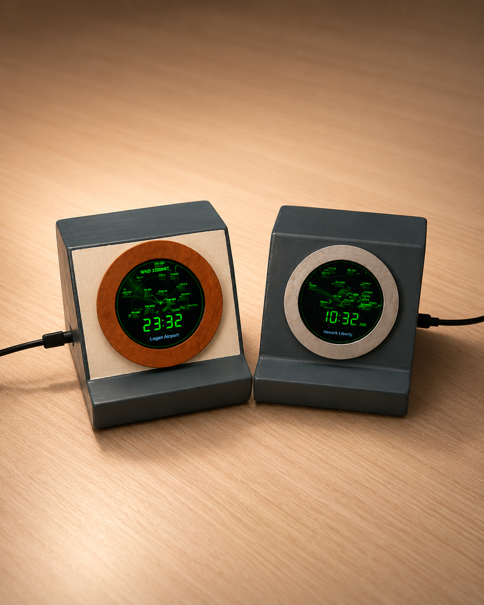
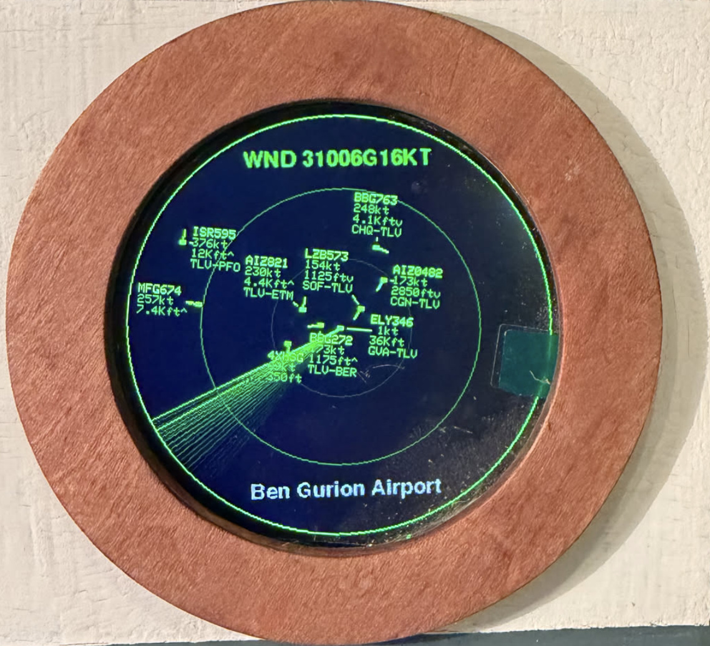

# Micro Radar

A live flight radar for an ESP32-S3 and a 2.1-inch, 360 × 360 GC9B72 round
display.

This is a fork of [Anthony Sturdy's Micro Radar](https://github.com/AnthonySturdy/micro-radar),
adapted from the original combined ESP32-C3/display module to an ESP32-S3 with a
separate display.





## Features

- Collision-aware aircraft labels with leader lines
- Smooth radar sweep with staged aircraft updates
- Workload separation across both ESP32-S3 cores
- Configurable sweep speed and aircraft symbols
- Optional speed, altitude, route, and surface-wind labels
- On-screen clock
- Web-based Wi-Fi, location, display, and OpenSky configuration
- Automatic or approval-based over-the-air firmware updates
- Optional ESP Insights remote diagnostics

## Hardware

- ESP32-S3 DevKitM-1 with an **N16R8** module (16 MB flash, 8 MB octal PSRAM)
- 2.1-inch 360 × 360 GC9B72 SPI TFT
- USB data cable
- Jumper wires or soldered connections

PSRAM is required for the display framebuffer and network operations. Do not
flash this build to a board without octal PSRAM. Check the voltage requirements
of your display board before connecting power.

## Wiring

The pin assignment is defined in [`include/LGFX.h`](include/LGFX.h).

| Display pin | ESP32-S3 pin |
|---|---:|
| `GND` | `GND` |
| `VCC` | Per display specification |
| `SCL` / `SCLK` | GPIO 12 |
| `SDA` / `MOSI` | GPIO 11 |
| `DC` | GPIO 3 |
| `CS` | GPIO 13 |
| `RST` / `RES` | GPIO 6 |
| `BL` / `LED` | GPIO 17 |

`MISO`/`SDO` and `TE` are unused. GPIO 12 and 11 intentionally use the
ESP32-S3's native SPI2 pins, allowing the display bus to run at 80 MHz.

The backlight is PWM-driven. If `BL` is a raw LED anode rather than a logic-level
enable, drive it through a transistor.

When changing the wiring, avoid GPIO 26–32 (flash), 33–37 (octal PSRAM), 19/20
(native USB), and 0/45/46 (strapping). GPIO 3 is a strapping pin but is safe for
the configured display `DC` signal.

## Build and upload

Install [PlatformIO](https://platformio.org/install/ide?install=vscode), connect
the board with a USB data cable, and upload the `esp32-s3-gc9b72` environment:

```bash
pio run -e esp32-s3-gc9b72 -t upload -t monitor
```

The serial monitor runs at `115200` baud. If uploading fails, use the board's
BOOT/RESET upload sequence. Display dimensions are configured in
[`include/DisplayConfig.h`](include/DisplayConfig.h).

## First-time setup

1. Power on the radar and join the `MicroRadar-Setup` Wi-Fi network.
2. Open `http://192.168.4.1` if the configuration page does not open
   automatically.
3. Enter the Wi-Fi network, radar location, OpenSky credentials, and display
   preferences, then save.
4. After the radar joins the network, reopen the configuration page at
   `http://microradar.local` or at the IP address shown on the display.

If the saved Wi-Fi network cannot be reached, the setup hotspot returns without
removing the other settings.

### OpenSky credentials

A free [OpenSky Network](https://opensky-network.org/) account and API client are
required. Create a client under **Account → API client**, then enter its client
ID and secret on the configuration page. Anonymous access is not used.

After three failed aircraft fetches, the display reports whether OpenSky rejected
the credentials, could not be reached, or exhausted the daily request allowance.
An empty radar without a warning means no aircraft were returned for the selected
area.

Route labels use [ADSBDB](https://www.adsbdb.com/), surface wind uses
[Open-Meteo](https://open-meteo.com/), place search uses
[Nominatim](https://nominatim.org/), and approximate location uses
[IPWhoIs](https://ipwhois.io/).

## Remote diagnostics

Optional remote diagnostics use [ESP Insights](https://insights.espressif.com).
Enter an ESP Insights auth key on the configuration page to enable it. Reporting
remains disabled until a key is supplied.

Reports may include crashes, warnings, free memory, uptime, Wi-Fi signal, SSID,
and IP address. They do **not** include the Wi-Fi password, OpenSky secret, or
radar coordinates. Get the device owner's consent before enabling reporting.
For local crash analysis, connect the device over USB and run
`scripts/pull-coredump.sh`.

## Enclosure

The files in `hardware/` were designed for the original combined ESP32-C3/TFT
module and may require modification for this ESP32-S3 and separate-display build.
See the [original repository](https://github.com/AnthonySturdy/micro-radar) for
assembly instructions.

## Credits and licence

Original project by [Anthony Sturdy](https://github.com/AnthonySturdy), inspired
by [therealhacksaw's desk radar](https://www.instagram.com/therealhacksaw/).

Distributed under the [MIT License](LICENSE), with the original copyright notice
retained.
