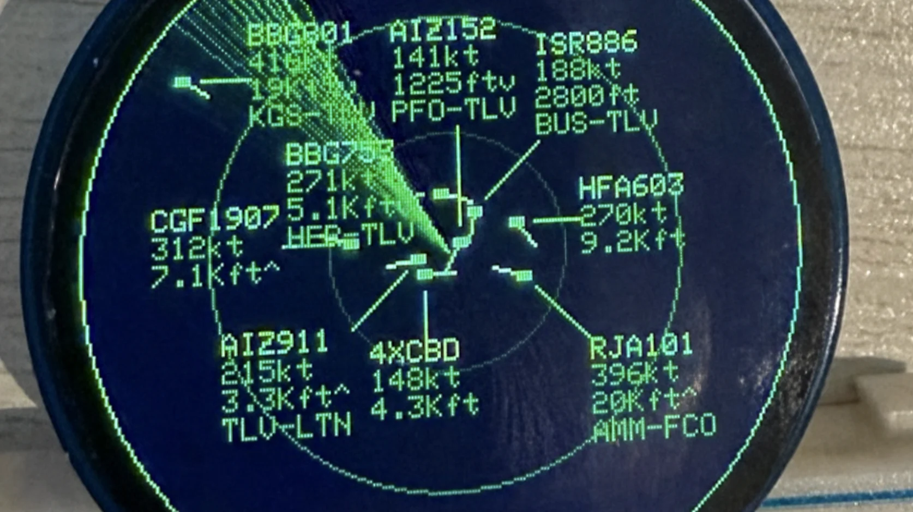
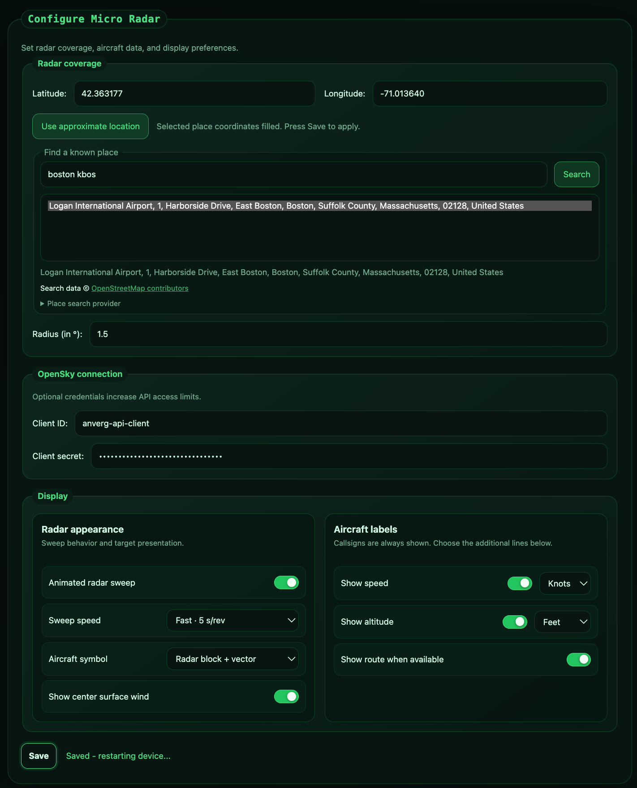

# 📡 Micro Radar — ESP32-S3 fork

A tiny live flight radar for a 1.28-inch round display.

> [!IMPORTANT]
> This is a fork of [Anthony Sturdy's Micro Radar](https://github.com/AnthonySturdy/micro-radar). Full credit to Anthony for the excellent original project, firmware, enclosure, and design. This fork adds enhancements; the original project remains Anthony's work.

I built this version with an **ESP32-S3 and a separate 1.28-inch 240 × 240 GC9A01 TFT** because I did not have the combined ESP32-C3/TFT module used by the original project.



## The main improvement: readable dense traffic

Aircraft text now tries to avoid other labels, markers, and the screen edge—even when many aircraft are close together.

The algorithm is a **discrete candidate local search**: it tests adjacent positions, short tangential slides, and a radial fallback, then uses iterated coordinate descent to balance overlap, off-screen text, obstructed or crossed leader lines, distance, ownership, and movement. A pairwise 2-opt repair step handles connector conflicts or swapped label pairs that single-label moves cannot fix.

It:

- moves labels to reduce overlap;
- keeps labels inside the round display;
- uses leader lines to connect moved labels to their aircraft;
- avoids crossed leader lines where possible;
- keeps placements stable so text does not constantly jump around.

## Other improvements

- Network and layout work run in the background for a smoother display.
- Aircraft updates appear as the radar sweep reaches each target instead of all jumping at once.
- Configurable sweep speed: 2, 5, 10, 18, or 30 seconds per revolution.
- Three aircraft symbols: radar vector, directional triangle, or dot.
- Optional speed, altitude, and `ORIGIN-DESTINATION` route labels.
- Optional aviation-style surface-wind readout for the configured radar centre.
- Knots or metres per second; metres or compact aviation-style feet.
- Improved configuration page with location detection and place search.

## Hardware

- ESP32-S3 DevKitM-1
- One of:
  - a 1.28-inch 240 × 240 GC9A01 SPI TFT, or
  - a 2.1-inch 360 × 360 GC9B72 SPI TFT (needs an **N16R8** module — 16 MB flash and 8 MB octal PSRAM)
- USB data cable
- Jumper wires or soldered connections

The 360 × 360 panel needs a 129,600-byte framebuffer, which does not fit in SRAM
alongside the Wi-Fi stack and a TLS handshake. On an N16R8 module the firmware
puts it in PSRAM automatically; on a board without PSRAM, OpenSky requests fail
with `SSL - Memory allocation failed`.

Check the voltage requirements of your exact display board before connecting power.

> [!NOTE]
> I do not have an ESP32-C3, so this fork has not been tested on one. The firmware compiles for the C3 and should theoretically work, but its single-core processor may be less smooth in dense scenes. The original combined C3/TFT module also requires its original display pin mapping.

## Wiring

The pin assignment is defined in [`include/LGFX.h`](include/LGFX.h). **The two
panels use different pins for `SCL` and `SDA`** — see the note below.

| Display pin | GC9A01 (1.28") | GC9B72 (2.1") |
|---|---:|---:|
| `GND` | `GND` | `GND` |
| `VCC` | Per display specification | Per display specification |
| `SCL` / `SCLK` | GPIO 11 | **GPIO 12** |
| `SDA` / `MOSI` | GPIO 12 | **GPIO 11** |
| `DC` | GPIO 2 | GPIO 2 |
| `CS` | GPIO 13 | GPIO 13 |
| `RST` / `RES` | Not controlled by firmware | **GPIO 6** |
| `BL` / `LED` | Not controlled by firmware | `3V3` |

`MISO`/`SDO` and `TE` are not used by either panel.

> [!IMPORTANT]
> `SCL` and `SDA` are swapped between the two panels on purpose. GPIO 12 and 11
> are the ESP32-S3's native IOMUX pins for SPI2 (`FSPICLK` and `FSPID`), and
> matching them lets the bus bypass the GPIO matrix. That raises the SPI ceiling
> from 40 MHz to 80 MHz, which roughly halves the time to push a 360 × 360 frame
> and is the difference between a jumpy and a smooth radar sweep.

If your wiring is different, update `include/LGFX.h`.

## Build and upload

1. Install [VS Code](https://code.visualstudio.com/) and [PlatformIO](https://platformio.org/install/ide?install=vscode).
2. Open this repository in VS Code.
3. Connect the ESP32-S3 with a USB data cable.
4. Pick the environment for your display, then run **PlatformIO: Upload**.

| Display | Environment |
|---|---|
| 1.28-inch GC9A01 | `esp32-s3-devkitm-1` |
| 2.1-inch GC9B72 | `esp32-s3-gc9b72` |

The panel is selected with a build flag, so both share one codebase — see
[`include/DisplayConfig.h`](include/DisplayConfig.h). Do not flash the
`esp32-s3-gc9b72` environment to a board without octal PSRAM; it configures the
module for 16 MB flash and 8 MB OPI PSRAM.

From the command line:

```bash
pio run -e esp32-s3-gc9b72 -t upload -t monitor
```

The serial monitor runs at `115200` baud. If uploading fails, use your board's BOOT/RESET upload sequence.

## Setup

On first boot, connect to:

```text
MicroRadar-Setup
```

Enter your Wi-Fi details. After the radar restarts, configure it from another device on the same network:

```text
http://microradar.local
```

If mDNS is unavailable, use the IP address shown by the serial monitor or router.

## Configuration



The web page lets you set:

- radar centre and radius;
- current, approximate, or searched location;
- short location name shown at the bottom of the display;
- OpenSky client credentials;
- sweep animation and speed;
- aircraft symbol;
- center surface-wind readout;
- speed, altitude, units, and route labels.

When the surface-wind display is enabled, it uses an aviation-style readout. For example, `WND 32025G30KT` means wind from 320° at 25 knots, gusting to 30 knots.

Saving restarts the radar.

An [OpenSky Network](https://opensky-network.org/) account is optional but provides a larger request allowance. Route labels use [ADSBDB](https://www.adsbdb.com/), and center surface wind uses [Open-Meteo](https://open-meteo.com/). Place search uses [Nominatim](https://nominatim.org/), and approximate location uses [IPWhoIs](https://ipwhois.io/).

## Enclosure files

The `hardware/` files come from the original project and were designed for its combined ESP32-C3/TFT module. They may need modification for an ESP32-S3 and separate display.

See the [original repository](https://github.com/AnthonySturdy/micro-radar) for Anthony's enclosure and assembly instructions.

## Credits and licence

Original project by [Anthony Sturdy](https://github.com/AnthonySturdy). It was inspired by [therealhacksaw's desk radar](https://www.instagram.com/therealhacksaw/).

Distributed under the [MIT License](LICENSE), with the original copyright notice retained.
